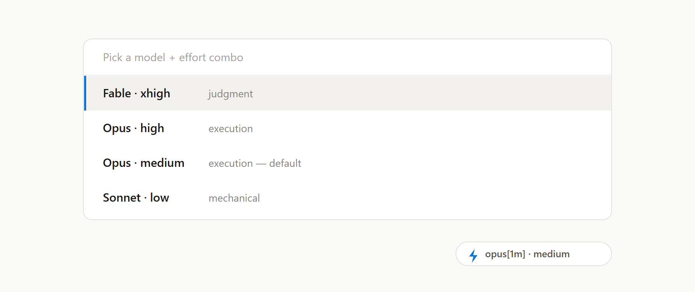

<p align="center">
  
</p>

<h1 align="center">Claude Combo</h1>

<p align="center">
  Pick a Claude Code <b>model + effort</b> combo in one keystroke —<br>
  from a QuickPick you define yourself.
</p>

<p align="center">
  <a href="#install">Install</a> ·
  <a href="#configuration">Configuration</a> ·
  <a href="#hard-limitation-by-design-not-a-bug">Limitation</a>
</p>

---

Switching model in Claude Code resets effort to that model's default, so a real switch is
always two steps: `/model`, then `/effort`. This is a ~200-line VS Code extension that
makes it one.

## What it does

1. The status bar shows your current combo (`⚡ opus[1m] · medium`).
2. Click it — or press `Ctrl+Alt+M` (`Cmd+Alt+M` on Mac) — to open the QuickPick.
3. Picking a combo writes the `model` and `effortLevel` keys into a Claude Code
   `settings.json`, then opens a new Claude conversation.

No build step, no dependencies — plain CommonJS, three files.

## Install

You need VS Code (or Cursor) with the **Claude Code** extension already installed.
Nothing else — no Node, no git, no build.

### The easy way — 3 clicks, no terminal

1. **Download the file.** Open the
   [latest release](https://github.com/kisoolabs/claude-combo/releases/latest) and click
   `claude-combo-0.0.3.vsix` under **Assets** to download it. (Your browser may ask you to
   confirm the download — a `.vsix` is just a zip file VS Code knows how to open.)
2. **Open the Extensions panel in VS Code.** Press `Ctrl+Shift+X`
   (`Cmd+Shift+X` on Mac).
3. **Install it.** Click the `…` button at the top of that panel →
   **Install from VSIX…** → select the file you just downloaded (it is in your
   `Downloads` folder).

That's it. VS Code says *"Completed installing extension"*, and the status bar at the
bottom right starts showing your current combo, e.g. `⚡ opus[1m] · medium`.
If you don't see it, press `Ctrl+Shift+P` (`Cmd+Shift+P`), type
`Developer: Reload Window`, and press Enter.

The same three steps work in Cursor.

To try it: press `Ctrl+Alt+M` (`Cmd+Alt+M` on Mac) — the QuickPick opens.

### From source — for developers

Only needed if you want to edit the code. Requires `git`.

**Windows** — open PowerShell (press `Win+X`, choose **Terminal** or
**Windows PowerShell**), then paste the three lines one at a time:

```powershell
git clone https://github.com/kisoolabs/claude-combo.git
cd claude-combo
powershell -ExecutionPolicy Bypass -File .\install.ps1
```

**Mac** — open Terminal (press `Cmd+Space`, type `Terminal`, press Enter):

```bash
git clone https://github.com/kisoolabs/claude-combo.git
cd claude-combo
bash ./install.sh
```

Add `-Cursor` (Windows) or `--cursor` (Mac) to the last line to install into Cursor too.
Then reload the window: `Ctrl+Shift+P` / `Cmd+Shift+P` → `Developer: Reload Window`.

Pick **one** of the two paths — both write to the same extension folder.

The full runbook (each step with a check, what to do when a step fails, the
edit → reinstall → reload loop, uninstall): [INSTALL.md](INSTALL.md).

## Hard limitation (by design, not a bug)

**A picked combo applies to the *next* conversation, never the running one.**
The Claude Code VS Code extension exposes no command or API for changing the model or
effort of a live session — its contributed commands are all open/new-conversation
variants. A running session still needs `/model` + `/effort`.

## Configuration

```jsonc
"claudeCombo.presets": [
  { "label": "Fable · xhigh", "model": "fable",    "effort": "xhigh",  "detail": "judgment" },
  { "label": "Opus · high",   "model": "opus[1m]", "effort": "high",   "detail": "execution" },
  { "label": "Opus · medium", "model": "opus[1m]", "effort": "medium", "detail": "execution" },
  { "label": "Sonnet · low",  "model": "sonnet",   "effort": "low",    "detail": "mechanical" }
],
"claudeCombo.applyTarget": "user",                  // "user" | "workspace" | "allSlots"
"claudeCombo.slotsRoot": "",                        // "" = auto-detect; allSlots only
"claudeCombo.openNewConversationAfterPick": true,
"claudeCombo.showStatusBarItem": true
```

- `model` — anything `claude --model` accepts: `fable`, `opus`, `sonnet`, `opus[1m]`,
  or a full model id such as `claude-fable-5`.
- `effort` — `low` | `medium` | `high` | `xhigh` (the enum the settings schema accepts;
  the CLI's `--effort max` has no persisted-settings equivalent). Omit to leave effort
  untouched.
- Order in the array is the order in the QuickPick. Edit via the QuickPick's
  "Edit presets…" entry or the `Claude Combo: Edit presets` command.

### Apply target

| `applyTarget` | Writes to | Effect |
|---|---|---|
| `user` | `$CLAUDE_CONFIG_DIR/settings.json`, else `~/.claude/settings.json` | This window's Claude config |
| `workspace` | `<project>/.claude/settings.json` | This project only; overrides the user setting |
| `allSlots` | `~/.claude/settings.json` **and** every `<slotsRoot>/*/config/settings.json` | Every window, whichever account slot it was launched on |

`workspace` is the way to pin a per-project default (e.g. a judgment-tier project always
opening on Fable). `Claude Combo: Pick model + effort (this project only)` forces the
workspace target for a single pick without changing the setting. The QuickPick also has an
inline "Switch apply target" entry, cycling `user` → `workspace` → `allSlots`.

**Account switchers:** Claude reads its user settings from `CLAUDE_CONFIG_DIR` whenever that
variable is set, which is how tools like claude-account-switcher give each window its own
account. This extension follows the same variable, so a pick lands in the settings file the
window actually uses — not in a `~/.claude/settings.json` nothing reads.

That also means `user` is *per window*: `CLAUDE_CONFIG_DIR` **replaces** `~/.claude` rather
than layering over it, so a pick made in one slot-pinned window has no effect on a window
pinned to a different slot. `allSlots` is the answer to that — it writes the same two keys
into `~/.claude/settings.json` and into each slot's own `settings.json`, so the combo holds
everywhere. Each file is read-modify-written, so a slot's own hooks and settings survive.
`slotsRoot` defaults to two levels up from this window's `CLAUDE_CONFIG_DIR` (i.e. the
switcher's vault root), falling back to `~/.claude-slots`.

Two things to know before turning `allSlots` on: slots belong to *different accounts*, so a
model one account cannot use will still be written into its slot; and the write race below
now spans every slot, including live sessions of other accounts.

The status bar reflects `user` settings overlaid with the current project's, matching how
Claude Code actually resolves them.

## Write safety

The two keys are set via read-modify-write, so every other key and the key order survive.
The previous file is copied to `settings.json.bak` before each write, and the new content
lands via a temp file + rename.

A live Claude session writing the same file (e.g. `/effort` persisting its choice) can
still race this extension. The `.bak` is the mitigation; the race cannot be eliminated.

With `allSlots` the guarantee is per file and unchanged — but one pick now writes (and backs
up) every slot, so the race surface is every account at once. Files are written
independently: one unreadable slot is reported and skipped, it does not cost the others
their write.

## Alternatives considered

- `claude --model X --effort Y` in a VS Code terminal profile — zero code, gives a
  dropdown of combos, but runs the terminal TUI instead of the native panel.
- `.claude/settings.json` per project — zero code, no picker; this extension's
  `workspace` target is a one-click way to write exactly that.

## License

MIT — see [LICENSE](LICENSE).
